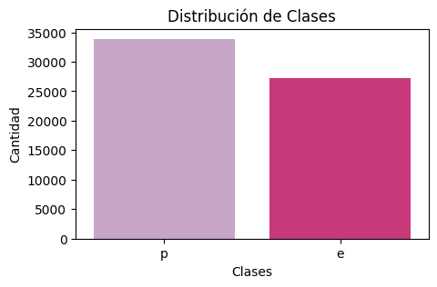
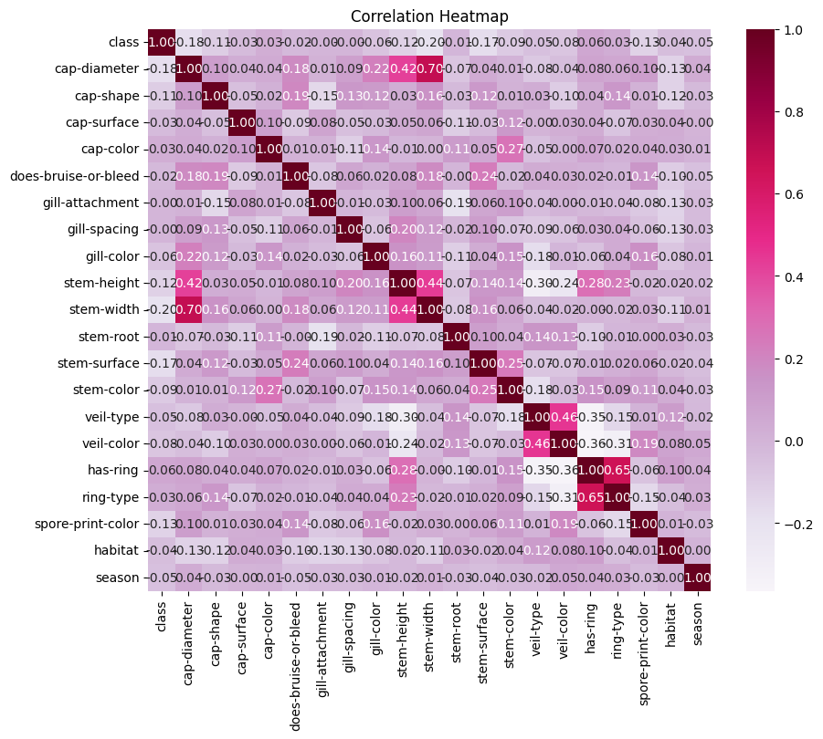
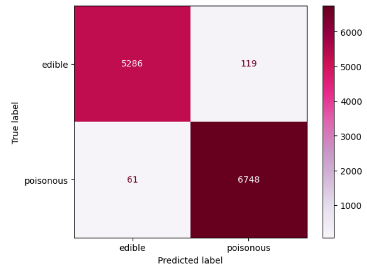
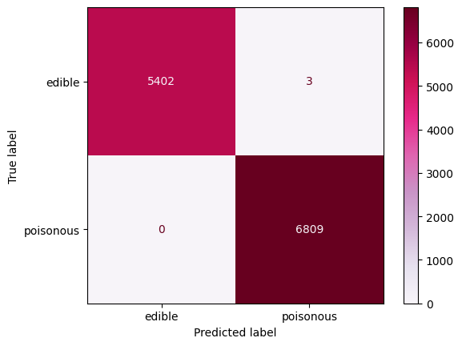

# Clasificación de hongos por medio de redes neuronales

## Abstract

La clasificación precisa de hongos en comestibles y venenosos es fundamental para la seguridad alimentaria
y para el desarrollo de nuevos tratamientos médicos. Este proyecto presenta un modelo de clasificación binaria
basado en redes neuronales artificiales de retropropagación (Backpropagation Neural Network, BPNN) para identificar
hongos comestibles y venenosos a partir de un conjunto de datos del UC Irvine Machine Learning, que incluye 61,069
observaciones y 20 variables.

Se realizó un preprocesamiento exhaustivo y se descartó la necesidad de reducción de dimensionalidad debido a la
baja multicolinealidad entre atributos. El modelo se implementó mediante una BPNN secuencial en Keras, utilizando
una arquitectura simple con una capa oculta de 128 neuronas y activación ReLU, seguida de una capa de salida con
activación sigmoide. En la evaluación inicial con Label Encoding, el modelo alcanzó una precisión del 99 %, mientras
que al incluir One-Hot Encoding logró un 100 % de precisión, minimizando errores de clasificación

## Introducción

La clasificación de los hongos en comestibles y venenosos constituye un aspecto fundamental de la micología,
ya que permite prevenir intoxicaciones, especialmente en comunidades indígenas donde su consumo es frecuente.
Los hongos silvestres comestibles representan una fuente valiosa de nutrientes y poseen un alto potencial para
mejorar la diversidad y calidad de la alimentación (Singh et al., 2025). Además, un estudio reciente identificó
a los hongos como una fuente rica en metabolitos secundarios con propiedades antivirales, destacando su
potencial en el desarrollo de nuevos tratamientos contra el SARS-CoV-2 (Patni et al., 2025).

En este contexto, el objetivo del presente proyecto es **desarrollar un clasificador binario que permita
distinguir entre hongos comestibles y venenosos**, utilizando para ello redes neuronales artificiales como
herramienta principal de modelado.

### Descripción del Dataset

El conjunto de datos proviene del [UC Irvine Machine Learning Repository](https://archive.ics.uci.edu/dataset/848/secondary+mushroom+dataset)
contiene 61,069 observaciones de hongos hipotéticos, clasificados según 173 especies, con un total de 353 ejemplares
por especie. Cada hongo se etiqueta como comestible, venenoso o de comestibilidad desconocida (esta última categoría
se combina con la de hongos venenosos). De las 20 variables descritas, 17 son de tipo nominal y 3 de tipo métrico.

Los hongos están clasificados de forma **binaria** en venenoso `p` y comestible `e`. Los atributos están clasificados
como nominales `n` y métricas `m`. A continuación se presenta una tabla con los atributos y sus respectivas descripciones.

| **Atributo**          | **Tipo** | **Descripción/Valores**                                                                                                        |
| --------------------- | -------- | ------------------------------------------------------------------------------------------------------------------------------ |
| **cap-diameter**      | m        | Float number in cm                                                                                                             |
| **cap-shape**         | n        | bell=b, conical=c, convex=x, flat=f, sunken=s, spherical=p, others=o                                                           |
| **cap-surface**       | n        | fibrous=i, grooves=g, scaly=y, smooth=s, shiny=h, leathery=l, silky=k, sticky=t, wrinkled=w, fleshy=e                          |
| **cap-color**         | n        | brown=n, buff=b, gray=g, green=r, pink=p, purple=u, red=e, white=w, yellow=y, blue=l, orange=o, black=k                        |
| **does-bruise-bleed** | n        | bruises-or-bleeding=t, no=f                                                                                                    |
| **gill-attachment**   | n        | adnate=a, adnexed=x, decurrent=d, free=e, sinuate=s, pores=p, none=f, unknown=?                                                |
| **gill-spacing**      | n        | close=c, distant=d, none=f                                                                                                     |
| **gill-color**        | n        | see cap-color + none=f                                                                                                         |
| **stem-height**       | m        | Float number in cm                                                                                                             |
| **stem-width**        | m        | Float number in mm                                                                                                             |
| **stem-root**         | n        | bulbous=b, swollen=s, club=c, cup=u, equal=e, rhizomorphs=z, rooted=r                                                          |
| **stem-surface**      | n        | see cap-surface + none=f                                                                                                       |
| **stem-color**        | n        | see cap-color + none=f                                                                                                         |
| **veil-type**         | n        | partial=p, universal=u                                                                                                         |
| **veil-color**        | n        | see cap-color + none=f                                                                                                         |
| **has-ring**          | n        | ring=t, none=f                                                                                                                 |
| **ring-type**         | n        | cobwebby=c, evanescent=e, flaring=r, grooved=g, large=l, pendant=p, sheathing=s, zone=z, scaly=y, movable=m, none=f, unknown=? |
| **spore-print-color** | n        | see cap color                                                                                                                  |
| **habitat**           | n        | grasses=g, leaves=l, meadows=m, paths=p, heaths=h, urban=u, waste=w, woods=d                                                   |
| **season**            | n        | spring=s, summer=u, autumn=a, winter=w                                                                                         |

## Metodología

### Preprocesamiento

El conjunto de datos tiene un tamaño de 61,069 filas y 21 columnas. Está compuesto por un total de 20 variables, de las cuales 3 son de tipo métrico `float64`:
_cap-diameter, stem-height y stem-width_. Las 17 variables restantes, incluida la variable objetivo class,
son de tipo categórico `object`. Estas variables describen características morfológicas del hongo, como forma,
color, superficie, presencia de anillo, tipo de velo, hábitat y estación de aparición, entre otras.

De los 61,069 registros, 33,888 corresponden a hongos venenosos
(etiquetados como `p`) y 27,181 a hongos comestibles (etiquetados como `e`). Aunque existe un leve desbalance entre las clases
—con un **56% de hongos venenosos y un 44% de comestibles**—, la diferencia no es lo suficientemente pronunciada como para requerir
técnicas específicas de balanceo. Se considera que el ligero desbalance no compromete la capacidad del modelo para aprender de
ambas clases.

  
   
  <em>Gráfica 1. Distribución de los datos en las clases venenoso (p) y comestible (e)</em>

#### Codificación de Etiquetas

Se transformaron las variables categóricas en valores númericos, lo que se conoce como
_Label Encoding_ o _Codificación de Etiquetas_. Parte fundamental del preprocesamiento
de los datos ya que el modelo no puede procesar datos categóricos directamente.

Inicialmente se aplico la técnica de _Label Encoding_ a todos los atributos. No obstante, esto
no evitaba que el modelo interpetrara relaciones entre los valores o que aprendiera un orden
no existente porque las categorías son nominales. Por ello, se aplicó _One-Hot Encoding_ a las columnas
con más de dos clases; conviritendo cada categoría a una columna binaria. Se mantuvo el _Label Encoding_
para las columnas binarias: _class, does-bruise-or-bleed y has-ring_.

#### Multicolinealidad

A través del análisis de la matriz de correlación y su correspondiente mapa de calor, se observó que los atributos
del conjunto de datos presentan niveles bajos de correlación entre sí, lo que indica una relativa independencia entre las
características. Esta ausencia de correlaciones fuertes sugiere que **no existen variables redundantes ni multicolinealidad
significativa que justifique, por el momento, la aplicación de técnicas de reducción de dimensionalidad**. Por lo tanto,
se decidió conservar todas las variables para el modelado inicial.

  
   
  <em>Gráfica 2. Mapa de calor de la matriz de correlación</em>

#### Chi-Square Score

Se evaluó el Chi-Square Score de cada variable con el objetivo de medir su grado de asociación con la variable
dependiente (la clase objetivo `class`). Esta prueba estadística permite evaluar que atrbibutos tiene una mayor
influencia en la clasificación. A mayor puntuación, mayor es la relación entre la variable independiente y la variable
de salida. Aunque en la etapa inicial no se busca la reducción de dimensionalidad, los resultados serán considerados
en una etapa posterior, para simplificar el modelo una vez que se cuente con un buen desempeño.

Las variables que mostraron una mayor asociación con la clase objetivo, según el valor del Chi-Square Score,
fueron: _stem-width, cap-diameter, stem-height, stem-surface, cap-shape, stem-color, spore-print-color, gill-color, habitat y season_.

### Modelo

La red neuronal definida en el modelo es una BPNN (Backpropagation Neural Network). Es una red neuronal que entrena con retropropagación. Jeatrakul y Wong (2009), al evaluar distintas arquitecturas para la clasificación binaria
encontraron que BPNN se comportaba de manera robusta en cada caso de prueba (diferentes conjuntos de datos). Lo que representaba una ventaja sin añadir la complejidad de una red CMTNN (Convolutional Multiscale Twin Neural Network).

Por lo tanto, en este proyecto se define una red neuronal simple utilizando Keras. Es un modelo secuencial, donde las capas van una detrás de otra. El modelo consiste de dos capas.
La primera capa es una capa densa que tiene 128 neuronas, se utiliza la función de activación `relu` para permitirle aprender relaciones complejas.
La segunda capa es la capa salida, tiene una sola neurona de salida debido a que es una clasificación binaria. La función de activación `sigmoid` asigna el valor de salida entre 0 y 1.
Para compilar la función se utiliza el optimizador Adam y se añade la función de pérdida `binary crossentropy`. Para evaluar el rendimiento del modelo se utiliza `accuracy`.

## Resultados

### Matriz de Confusión

La matriz de confusión es una herramienta fundamental en la evaluación del desempeño de los modelos de clasificación,
ya que proporciona una visualización detallada de las predicciones realizadas por el modelo en comparación con los valores reales
en el conjunto de datos de prueba. Según Wahyudi y Andrian (2021), la matriz de confusión permite calcular métricas clave como
la precisión y el recall. Estas métricas son esenciales para evaluar no solo la exactitud global del modelo, sino también su
capacidad para identificar correctamente ambas clases, minimizando falsos positivos y falsos negativos.

### Evaluación Inicial

El modelo alcanzó una precisión del 99 % en el conjunto de prueba utilizando _Label Enconding_ para todas las variables, lo que indica un desempeño altamente efectivo.
Las métricas de evaluación muestran resultados equilibrados entre ambas clases, lo que sugiere que el modelo no está
sesgado hacia ninguna de ellas. Además, la matriz de confusión evidenció un bajo número de errores, con únicamente 180
clasificaciones incorrectas sobre un total de 12,000 muestras. Se observó una ligera tendencia a generar más falsos
positivos que falsos negativos, aunque la diferencia es mínima.

  <table>
    <tr>
      <th>Clase</th>
      <th>Precisión</th>
      <th>Recall</th>
      <th>F1-score</th>
      <th>Soporte</th>
    </tr>
    <tr>
      <td>0</td>
      <td>0.99</td>
      <td>0.98</td>
      <td>0.98</td>
      <td>5405</td>
    </tr>
    <tr>
      <td>1</td>
      <td>0.98</td>
      <td>0.99</td>
      <td>0.99</td>
      <td>6809</td>
    </tr>
  </table>
   
  <em>Tabla 2. Resultados de evaluación del modelo de clasificación inicial.</em>

  
   
  <em>Gráfica 3. Matriz de confusión del modelo inicial</em>

### Usando One-Hot Encoding

Al cambiar la codificación de etiquetas para usar _One-Hot Encoding_ para las columnas con múltiples categorías.
El modelo obtuvo una precisión del 100%, lo que sugiere que esta técnica permitió una representación más adecuada
de las variables categóricas y, por lo tanto, una mayor capacidad de generalización. Se mantuvo la tendencia de
generar más falsos positivos, pero únicamente con 3 resultados erróneos.

  <table>
    <tr>
      <th>Clase</th>
      <th>Precisión</th>
      <th>Recall</th>
      <th>F1-score</th>
      <th>Soporte</th>
    </tr>
    <tr>
      <td>0</td>
      <td>1.00</td>
      <td>1.00</td>
      <td>1.00</td>
      <td>5405</td>
    </tr>
    <tr>
      <td>1</td>
      <td>1.00</td>
      <td>1.00</td>
      <td>1.00</td>
      <td>6809</td>
    </tr>
  </table>
   
  <em>Tabla 3. Resultados de evaluación del modelo con One-Hot Encoding.</em>

  
   
  <em>Gráfica 4. Matriz de confusión del modelo utilizando One-Hot Encoding</em>

## Referencias

Patni, B., Bhattacharyya, M., Pokhriyal, A. et al. Remedying SARS-CoV-2 through nature: a review highlighting the potentiality of herbs, trees, mushrooms, and endophytic microorganisms in controlling Coronavirus. Planta 261, 89 (2025). doi: https://doi.org/10.1007/s00425-025-04647-8

Singh A, Singh G, Kapoor R, Dhasmana A, Jerath S. G. Wild Edible Mushrooms of Jharkhand: Nutrient-Dense Seasonal Foods to Improve Dietary Diversity Among Indigenous Communities. Nutr Food Sci 2025; 13(1). doi : http://dx.doi.org/10.12944/CRNFSJ.13.1.4

P. Jeatrakul and K. W. Wong, "Comparing the performance of different neural networks for binary classification problems," 2009 Eighth International Symposium on Natural Language Processing, Bangkok, Thailand, 2009, pp. 111-115, doi: 10.1109/SNLP.2009.5340935.

Wahyudi, M., & Andriani, A. (2021). Application of C4.5 and Naïve Bayes Algorithm for Detection of Potential Increased Case Fatality Rate Diarrhea. Journal of Physics: Conference Series, 1830(1), 012016. https://doi.org/10.1088/1742-6596/1830/1/012016
