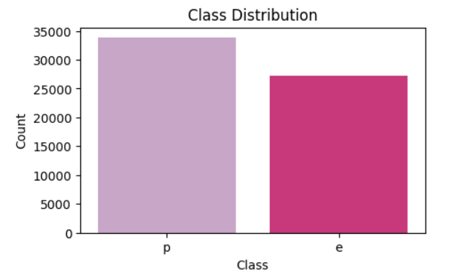
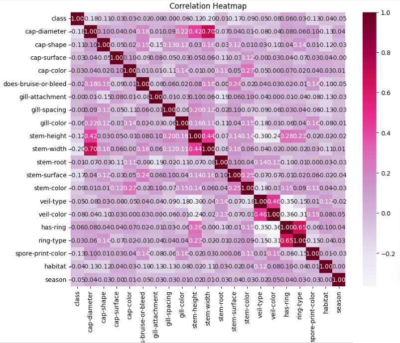
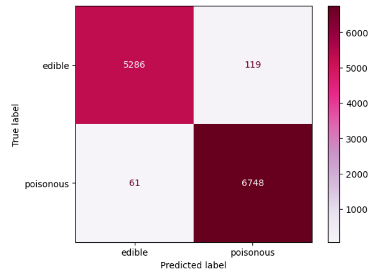

# Clasificador de Hongos

## Objetivo del Proyecto

El objetivo de este proyecto es desarrollar un clasificador binario de hongos que los catalogue como comestibles y venenosos.

## Descripción del Dataset

El data set proviene de [UC Irvine Machine Learning Repository](https://archive.ics.uci.edu/dataset/848/secondary+mushroom+dataset). Este conjunto de datos incluye 61,069 hongos hipotéticos con "sombreros" basados en 173 especies (353 hongos por especie). Cada hongo está identificado como definitivamente comestible, definitivamente venenoso o de comestibilidad desconocida y no recomendada (esta última clase fue combinada con la clase de hongos venenosos). De las 20 variables, 17 son nominales y 3 son métricas.

### Información de las clases

clases: venenoso = p, comestible = e (binaria)

### Información de las variables

n: nominal, m: métrica; los valores nominales se presentan como conjuntos de valores.

| **Variable**          | **Tipo** | **Descripción/Valores**                                                                                                        |
| --------------------- | -------- | ------------------------------------------------------------------------------------------------------------------------------ |
| **cap-diameter**      | m        | Float number in cm                                                                                                             |
| **cap-shape**         | n        | bell=b, conical=c, convex=x, flat=f, sunken=s, spherical=p, others=o                                                           |
| **cap-surface**       | n        | fibrous=i, grooves=g, scaly=y, smooth=s, shiny=h, leathery=l, silky=k, sticky=t, wrinkled=w, fleshy=e                          |
| **cap-color**         | n        | brown=n, buff=b, gray=g, green=r, pink=p, purple=u, red=e, white=w, yellow=y, blue=l, orange=o, black=k                        |
| **does-bruise-bleed** | n        | bruises-or-bleeding=t, no=f                                                                                                    |
| **gill-attachment**   | n        | adnate=a, adnexed=x, decurrent=d, free=e, sinuate=s, pores=p, none=f, unknown=?                                                |
| **gill-spacing**      | n        | close=c, distant=d, none=f                                                                                                     |
| **gill-color**        | n        | see cap-color + none=f                                                                                                         |
| **stem-height**       | m        | Float number in cm                                                                                                             |
| **stem-width**        | m        | Float number in mm                                                                                                             |
| **stem-root**         | n        | bulbous=b, swollen=s, club=c, cup=u, equal=e, rhizomorphs=z, rooted=r                                                          |
| **stem-surface**      | n        | see cap-surface + none=f                                                                                                       |
| **stem-color**        | n        | see cap-color + none=f                                                                                                         |
| **veil-type**         | n        | partial=p, universal=u                                                                                                         |
| **veil-color**        | n        | see cap-color + none=f                                                                                                         |
| **has-ring**          | n        | ring=t, none=f                                                                                                                 |
| **ring-type**         | n        | cobwebby=c, evanescent=e, flaring=r, grooved=g, large=l, pendant=p, sheathing=s, zone=z, scaly=y, movable=m, none=f, unknown=? |
| **spore-print-color** | n        | see cap color                                                                                                                  |
| **habitat**           | n        | grasses=g, leaves=l, meadows=m, paths=p, heaths=h, urban=u, waste=w, woods=d                                                   |
| **season**            | n        | spring=s, summer=u, autumn=a, winter=w                                                                                         |

# Proceso

## Preprocesamiento

### Análisis del Dataset

Antes de comenzar el preprocesamiento de los datos, se analizo el contenido del dataset. Se confirmo el tamaño de (61069,21) y se obtenieron los tipos de dato para las 21 columnas. La columna `class` representa la clasificación de los hongos.

| Variable     | class  | cap-diameter | cap-shape | cap-surface | cap-color | does-bruise-or-bleed | gill-attachment |
| ------------ | ------ | ------------ | --------- | ----------- | --------- | -------------------- | --------------- |
| Tipo de dato | object | float64      | object    | object      | object    | object               | object          |

| Variable     | gill-spacing | gill-color | stem-height | stem-width | stem-root | stem-surface | stem-color |
| ------------ | ------------ | ---------- | ----------- | ---------- | --------- | ------------ | ---------- |
| Tipo de dato | object       | object     | float64     | float64    | object    | object       | object     |

| Variable     | veil-type | veil-color | has-ring | ring-type | spore-print-color | habitat | season |
| ------------ | --------- | ---------- | -------- | --------- | ----------------- | ------- | ------ |
| Tipo de dato | object    | object     | object   | object    | object            | object  | object |

Se analizó la distribución de los datos para ambas clases y se demostró que el dataset se encuentra balanceado.

### Label Encoding

Se convirtieron cada categoría única representada con texto en números utilizando `Label Encoder`.

### Impacto de Variables

A través de una matriz de correlación, el dataset mostró que las variables eran independientes y no había necesidad de reducirlas en este momento.

### Importancia de las Variables

Se evaluó el Chi Square Score de todas las variables para evaluar su relación entre las variables independientes y la clasificación. Entre mayor sea el valor mayor relación existe con la clase objetivo. Estos valores se utilizar posteriormente cuando se logré un modelo que clasifique adecuadamente, para reducir que tan pesado es dicho modelo.

## Modelo

La red neuronal definida en el modelo es una BPNN (Backpropagation Neural Network). Es una red neuronal que entrena con retropropagación. Jeatrakul y Wong (2009), al evaluar distintas arquitecturas para la clasificación binaria
encontraron que BPNN se comportaba de manera robusta en cada caso de prueba (diferentes data sets). Lo que representaba una ventaja sin añadir la complejidad de una red CMTNN (Convolutional Multiscale Twin Neural Network).

Por lo tanto, en este proyecto se define una red neuronal simple utilizando Keras. Es un modelo secuencial, donde las capas van una detrás de otra. El modelo consiste de dos capas.
La primera capa es una capa densa que tiene 128 neuronas, se utiliza la función de activación `relu` para permitirle aprender relaciones complejas.
La segunda capa es la capa salida, tiene una sola neurona de salida debido a que es una clasificación binaria. La función de activación `sigmoid` asigna el valor de salida entre 0 y 1.
Para compilar la función se utiliza el optimizador Adam y se añade la función de pérdida `binary crossentropy`. Para evaluar el rendimiento del modelo se utiliza `accuracy`.

## Evaluación Inicial

El modelo acertó el 99% de las prediciones en el data set de prueba. Las métricas son similares entre ambas clases lo que muestra que no está sesgado hacia una clase u otra.
Además la matriz de confusión demostró que el modelo cometé pocos errores, sólo 180 sobre 12 mil datos de muestra. Clasifico un poco más de falsos positivos que falsos negativos.

| Clase | Precisión | Recall | F1-score | Soporte |
| ----- | --------- | ------ | -------- | ------- |
| 0     | 0.99      | 0.98   | 0.98     | 5405    |
| 1     | 0.98      | 0.99   | 0.99     | 6809    |

## Referencias

P. Jeatrakul and K. W. Wong, "Comparing the performance of different neural networks for binary classification problems," 2009 Eighth International Symposium on Natural Language Processing, Bangkok, Thailand, 2009, pp. 111-115, doi: 10.1109/SNLP.2009.5340935.
